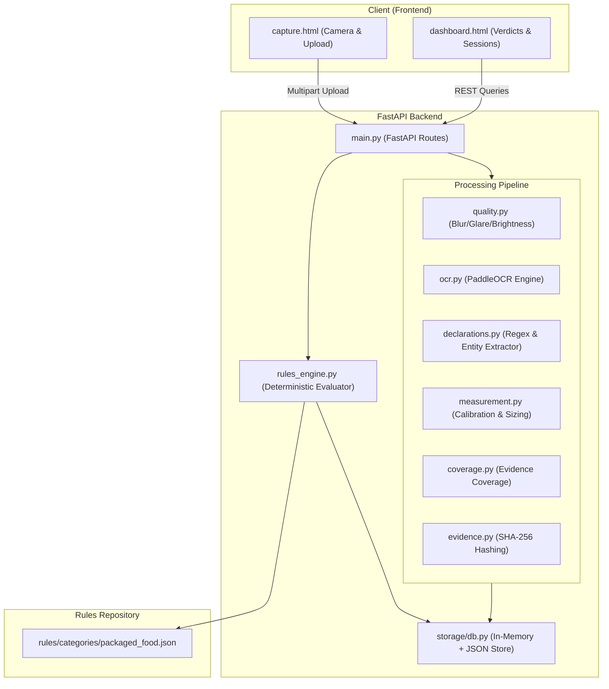

# LegalMetrology.AI
**Field-Deployable Legal Metrology Inspection Intelligence**

---

## 1. Overview
LegalMetrology.AI is an automated computer vision and OCR-assisted compliance auditing system designed for Legal Metrology packaged commodity standards. The system converts uncontrolled smartphone photographs of physical packaged commodities into measurable, rule-versioned, evidence-backed inspection findings.

## 2. Problem
Field inspectors in legal metrology face a manual, tedious process when verifying mandatory package declarations (Net Qty, MRP, Manufacturer details, Expiry, Font Heights) according to the Legal Metrology Packaged Commodities (LMPC) Rules. Physical inspections often lack standardized evidence trails and can be subject to human error when taking manual font and panel measurements.

## 3. Solution
This project provides a Human-in-the-Loop (HITL) software solution. Rather than attempting to replace inspectors, LegalMetrology.AI empowers them with an intelligent assistant that automatically performs OCR-based declaration extraction, physical measurement, and deterministic rule evaluation directly from smartphone evidence.

## 4. Core Features
- **Multi-Photo Evidence Aggregation**: Combines extracted data from multiple sides of a package (Principal Display Panel, back, sides).
- **Field-Phone to Laptop Workflow**: Seamlessly bridges a mobile phone (for camera capture) and a laptop (for processing and dashboard view) over a local network.
- **Computer Vision Quality Assessment**: Pre-evaluates images for blur, glare, and brightness before running expensive OCR operations.
- **PaddleOCR Engine**: Highly accurate text and bounding box extraction using PaddleOCR.
- **Declaration Extraction**: NLP-driven regex extraction for net quantity, MRP, manufacturing dates, expiry, and manufacturer details.
- **Physical Measurement with Uncertainty**: Computes physical dimensions (e.g., font heights) based on pixel-to-metric calibration with uncertainty intervals.
- **Deterministic Versioned Rule Evaluation**: JSON-driven rules engine that evaluates extracted measurements against versioned legal metrology rules.
- **Tamper-Evident SHA-256 Evidence**: Cryptographically hashes all incoming imagery and outgoing verdicts to establish a verifiable audit trail.
- **Graceful "INCONCLUSIVE" Handling**: A robust three-state outcome model that prevents unsupported automated decisions when evidence is insufficient.

## 5. System Architecture


## 6. Inspection Workflow
The overall pipeline follows the actual terminology of inspection:
**CAPTURE → CHECK → READ → MEASURE → VERIFY → REPORT**

1. **CAPTURE**: The inspector takes photos using their smartphone.
2. **CHECK**: Images are passed through the Quality Gate.
3. **READ**: PaddleOCR and extraction routines read the package declarations.
4. **MEASURE**: Principal Display Panel (PDP) and font heights are computed.
5. **VERIFY**: The rule engine deterministically evaluates the metrics against LMPC rules.
6. **REPORT**: A tamper-evident inspection report is generated.

## 7. Phone-to-Laptop Architecture
The application runs the backend (FastAPI) and frontend (HTML/JS) on the inspector's laptop. 
Through dynamic network configuration, the inspector scans a QR code (or navigates to the laptop's LAN IP address) using their mobile device to access the `capture.html` interface. Images captured on the phone are instantly transmitted to the laptop via REST API for local processing.

## 8. Technology Stack
- **Backend:** Python 3.10+, FastAPI, Uvicorn, PaddleOCR, OpenCV, NumPy
- **Frontend:** Vanilla HTML, CSS, JavaScript (WebRTC for camera access)
- **Data & Rules:** JSON

## 9. Repository Structure
```
legal-metrology/
├── backend/
│   ├── models/                  # Pydantic schemas
│   ├── services/                # Core business logic (OCR, rules, quality)
│   ├── storage/                 # Database abstraction and JSON persistence
│   ├── uploads/                 # Temporary runtime image storage
│   ├── main.py                  # FastAPI application
│   └── requirements.txt         # Python dependencies
├── data/
│   └── test_images/             # Sample evidence for testing
├── docs/
│   └── architecture.md          # Technical documentation
├── frontend/
│   ├── assets/                  # CSS styles and JS logic
│   ├── capture.html             # Mobile camera capture interface
│   └── dashboard.html           # Laptop inspection dashboard
├── rules/
│   └── categories/              # JSON LMPC rules configurations
├── tests/                       # Unit and Integration Tests
├── .gitignore                   # Ignored runtime artifacts
└── README.md                    # This file
```

## 10. Setup & Installation
**Prerequisites**: Windows 10/11, Python 3.10+, and a functional webcam or smartphone.

1. Clone the repository:
```powershell
git clone <repository_url>
cd legal-metrology
```

2. Create a virtual environment:
```powershell
python -m venv .venv
.\.venv\Scripts\Activate.ps1
```

3. Install backend requirements:
```powershell
cd backend
pip install -r requirements.txt
```

## 11. Running the Backend
Ensure the virtual environment is activated, then start the FastAPI server:
```powershell
# From the backend directory
uvicorn main:app --host 0.0.0.0 --port 8000
```
*Note: Using `0.0.0.0` is required to allow phone connections over the LAN.*

## 12. Running the Frontend
In a new terminal window (from the workspace root), start a static server for the frontend. You can use Python's built-in server:
```powershell
# From the legal-metrology root directory
python -m http.server 3000 --directory frontend
```
Open your laptop browser to `http://localhost:3000/dashboard.html` to view the dashboard.

## 13. Phone Field Capture Setup
1. Ensure your laptop and phone are on the same Wi-Fi network (or mobile hotspot).
2. Find your laptop's IPv4 address (`ipconfig` in PowerShell, e.g., `192.168.1.5`).
3. Open the browser on your phone and go to: `http://192.168.1.5:3000/capture.html`
4. The capture interface will intelligently detect the host IP and transmit captured images directly to the backend.

## 14. Example Inspection Flow
- Start the server and connect your phone.
- On your phone, tap **Capture** to take a picture of the front of a package.
- Tap **Capture** again for the back (ingredients/nutrition panel).
- Check the laptop dashboard. The session will automatically aggregate the evidence, run PaddleOCR, measure the text, and evaluate compliance.

## 15. Compliance / Verdict Model
The system enforces a strict three-state outcome to prevent false automation:
- **COMPLIANT**: All required declarations are present, readable, and meet minimum physical size/metric requirements.
- **POTENTIAL_NON_COMPLIANCE**: A clear violation of rules was detected (e.g., MRP is missing, or font size is definitively too small).
- **INCONCLUSIVE**: The system cannot make a definitive ruling (e.g., glare obscured the text, image resolution is too low, or physical measurement uncertainty is too high). This gracefully falls back to the human inspector.

## 16. Evidence Integrity
Every photo uploaded to the system is instantly assigned a cryptographic SHA-256 hash. The final inspection report includes these hashes along with the version of the rules engine used. This establishes a mathematically verifiable chain of custody for any legal proceedings resulting from the inspection.

## 17. Current Limitations
- **Lighting Sensitivity:** Highly reflective packaging (foil/glossy plastic) can occasionally trigger the quality gate's glare detection, forcing a re-capture.
- **Physical Calibration:** Currently assumes a standard distance or reference object for pixel-to-metric conversion; full depth-camera integration is not fully implemented.
- **Language:** Currently optimized for English-language declarations.
- **Runtime Generation:** Test images and session data are stored locally in the filesystem during runtime; enterprise cloud persistence is not integrated.

## 18. Future Improvements
- **Multi-Lingual OCR:** Expanding PaddleOCR models to support regional languages for local packaging.
- **AR Calibration:** Utilizing mobile ARKit/ARCore for precise, depth-aware dimension calibration without reference markers.
- **Offline Mode:** Deploying lightweight inference models directly to the mobile device for environments with zero network connectivity.

## 19. Development Notes
- The API operates purely on REST endpoints. WebSockets were considered but polling is currently used for simplicity in the prototype.
- Images are persisted locally to `backend/uploads/` and data to `backend/storage/sessions.json` during execution. These are local runtime artifacts and are correctly ignored by source control.

## 20. Smart India Hackathon 2026 Context
This prototype was originally developed and architected for the **Smart India Hackathon 2026 (Problem Statement PS26034)**. It was built to demonstrate a pragmatic, field-deployable AI approach to augmenting legal metrology compliance in India.
