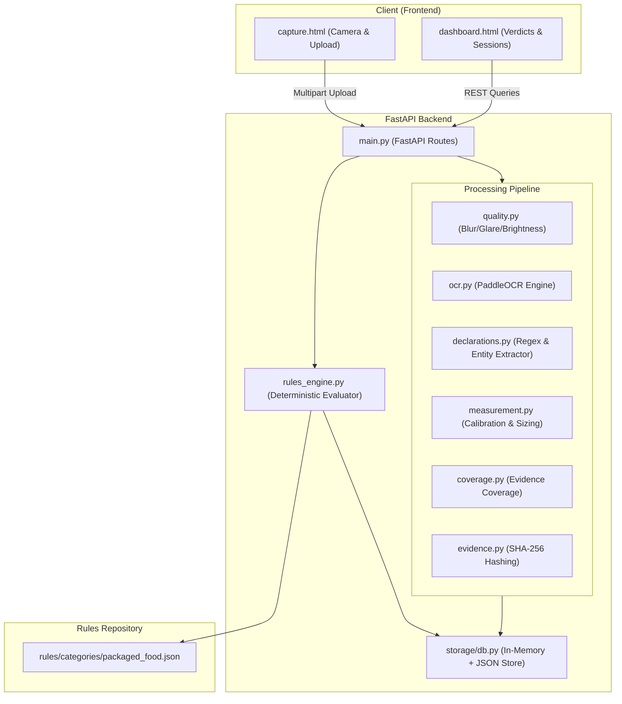

# Architecture & System Design

## 1. System Overview

The Legal Metrology Compliance Verification System automates the verification of mandatory package declarations (Net Qty, MRP, Manufacturer details, Expiry, Font Heights, etc.) according to Legal Metrology Packaged Commodities (LMPC) Rules.

---

## 2. Core Service Responsibilities

1. **`quality.py`**:
   - Evaluates image suitability before OCR:
     - Laplacian variance for blur detection.
     - Pixel intensity histograms for under/over-exposure.
     - Specular reflection / glare thresholding.

2. **`ocr.py`**:
   - Pre-processes images (adaptive thresholding, deskewing).
   - Extracts bounding boxes and text tokens via PaddleOCR engine.

3. **`declarations.py`**:
   - Parses domain-specific entities using robust regex and rule patterns:
     - Net quantity & unit standardization (g, kg, ml, l).
     - MRP with currency and tax declaration (incl. of all taxes).
     - Month/year of manufacture/packing.
     - Best before / Expiry period.
     - Customer care contact (email, telephone).
     - Manufacturer & Packer identity with address/PIN code.

4. **`measurement.py`**:
   - Computes principal display panel (PDP) dimensions and font sizes.
   - Calculates measurement uncertainty intervals.

5. **`coverage.py`**:
   - Assesses multi-panel coverage to determine whether sufficient evidence exists across all sides.

6. **`rules_engine.py`**:
   - Loads versioned JSON rules.
   - Applies deterministic matching and threshold evaluations against extracted values and measurements.

7. **`evidence.py`**:
   - Computes cryptographic SHA-256 digests for all raw images and final verdicts to ensure auditability and tamper-evidence.

8. **`storage/db.py`**:
   - Thread-safe storage abstraction persisting session state and evaluation artifacts.
